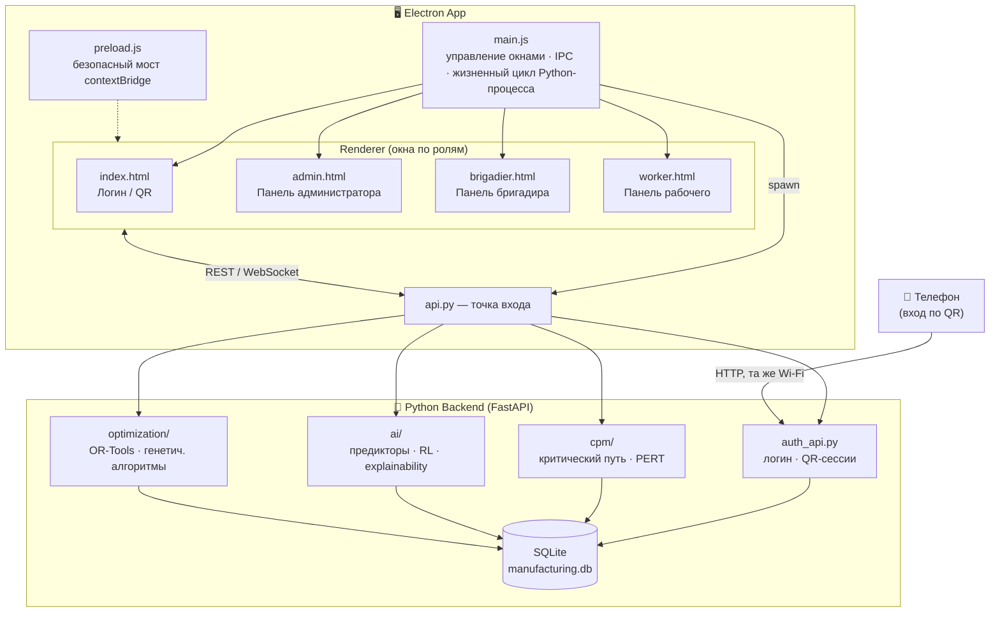
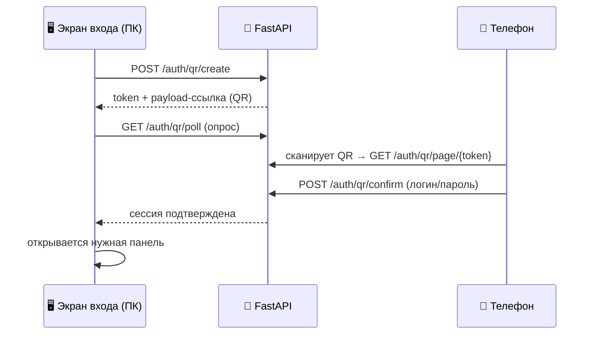

<div align="center">


<a href="https://github.com/VinfinityVois/NEVZ">
  
</a>

<br>

[](#-установка)
[](#-технологический-стек)
[](#-технологический-стек)
[](#-технологический-стек)
[](docs/changelog/CHANGELOG.md)


<br>


<br><br>

**[✨ Возможности](#-ключевые-возможности)** &nbsp;•&nbsp;
**[🏗 Архитектура](#-архитектура)** &nbsp;•&nbsp;
**[🚀 Быстрый старт](#-быстрый-старт)** &nbsp;•&nbsp;
**[👤 Роли](#-роли-и-права-доступа)** &nbsp;•&nbsp;
**[🧠 AI](#-ai--машинное-обучение)** &nbsp;•&nbsp;
**[🔌 API](#-api)** &nbsp;•&nbsp;
**[❓ FAQ](#-faq--известные-особенности)**

</div>

<br>

## 📖 О проекте

**Manufacturing Optimizer** (кодовое название **NEVZ**) — десктопное приложение для планирования и оптимизации производственных процессов, построенное на классическом сетевом планировании (**CPM/PERT**) и усиленное собственным AI-движком: предсказание срывов сроков, обнаружение аномалий, автоматическое «латание» пробелов в графике и обучение на исторических данных.

Приложение работает как связка **Electron-клиента** (три специализированные панели — администратор, бригадир, рабочий) и локального **Python/FastAPI-бэкенда**, который считает критический путь, запускает ML-модели и хранит данные в SQLite.

> 💡 Проект ориентирован на производственные предприятия, где важно одновременно видеть сетевой график, реальную загрузку бригад и получать AI-рекомендации о том, где график «поплывёт» раньше, чем это станет проблемой.

<br>

<div align="center">

</div>

## ✨ Ключевые возможности

<table>
<tr>
<td width="50%" valign="top">

### 📊 Планирование и расчёты
- Построение сетевого графика на основе **CPM** (критический путь) и **PERT** (вероятностные оценки)
- Расчёт резервов времени (slack), сжатие графика (crashing), выравнивание ресурсов
- Интерактивная **диаграмма Ганта** (frappe-gantt) и сетевые диаграммы (Cytoscape + dagre)
- Импорт/экспорт данных в Excel (`.xlsx/.xls/.xlsb`) и CSV

### 🤖 AI и оптимизация
- Предиктивные модели срыва сроков (Gradient Boosting, XGBoost, LightGBM, CatBoost, ансамбли)
- Детектор аномалий и «охотник за пробелами» (gap detector / bridger) в графике
- Оптимизация бригад: линейное программирование, генетический алгоритм, OR-Tools
- Обучение с подкреплением (RL) для адаптивного планирования
- Explainable AI: **SHAP** и **LIME** для объяснения решений модели

</td>
<td width="50%" valign="top">

### 👥 Ролевая модель
- Три специализированные панели: **Администратор**, **Бригадир**, **Рабочий**
- Вход по логину/паролю **или по QR-коду** со смартфона (см. [ниже](#-вход-по-qr-коду))
- Гибкое управление бригадами, задачами и загрузкой персонала

### ⚙️ Технические особенности
- Локальный REST API на FastAPI, автосвязка Electron ↔ Python при старте
- SQLite как единая база данных
- Real-time обновления через WebSocket
- Мультиязычный интерфейс (RU / EN, `locales/*.json`)
- Кроссплатформенная сборка: Windows (NSIS), macOS (DMG), Linux (AppImage)

</td>
</tr>
</table>

<br>

## 🏗 Архитектура

Приложение построено по схеме **«толстый клиент + локальный сервис»**: Electron поднимает Python-процесс как дочерний, всё общение идёт по `http://127.0.0.1:8000`.



**Ключевая идея роутинга ролей** (`auth_api.py → row_user()`):

```
role == "admin"        →  открывается панель администратора
is_brigadier == 1      →  открывается панель бригадира
иначе                  →  открывается панель рабочего
```

<br>

## 🧰 Технологический стек

| Слой | Технологии |
|---|---|
| **Desktop-оболочка** | Electron 27, IPC + `contextBridge`, `electron-builder` |
| **Frontend / UI** | Vanilla JS, HTML5, CSS3 (кастомные тёмные темы), Anime.js |
| **Визуализация** | Handsontable (таблицы), Frappe Gantt (диаграмма Ганта), Cytoscape + dagre (сетевые графы) |
| **Backend API** | Python 3.10+, FastAPI, Uvicorn, Pydantic, WebSockets |
| **Данные** | SQLite, SQLAlchemy, aiosqlite, Pandas, NumPy, OpenPyXL |
| **Машинное обучение** | scikit-learn, XGBoost, LightGBM, CatBoost, NetworkX |
| **Оптимизация** | Google OR-Tools, генетические алгоритмы, линейное программирование |
| **Explainable AI** | SHAP, LIME |
| **Безопасность** | passlib (bcrypt), python-jose |

<br>

## 📁 Структура проекта

<details>
<summary><b>Развернуть дерево каталогов</b> 📂</summary>

```
NEVZ/
└── EVA/manufacturing-optimizer/
    ├── electron-app/                 # Desktop-клиент
    │   ├── main.js                   # Главный процесс: окна, IPC, запуск Python
    │   ├── preload.js                # contextBridge API для renderer'а
    │   └── renderer/
    │       ├── index.html            # Экран входа (логин / QR)
    │       ├── admin.html            # Панель администратора
    │       ├── brigadier.html        # Панель бригадира
    │       ├── worker.html           # Панель рабочего
    │       ├── css/                  # Стили (по одной теме на экран)
    │       ├── js/{admin,worker,brigadier,shared}/
    │       └── locales/{ru,en}.json  # Локализация
    │
    ├── python-backend/               # Backend-сервис
    │   ├── api.py                    # Точка входа FastAPI
    │   ├── auth_api.py               # Аутентификация, роли, QR-вход
    │   ├── api/                      # REST-роутеры (admin, workers, brigades, reports…)
    │   ├── cpm/                      # Критический путь, PERT, резервы, сжатие графика
    │   ├── ai/                       # Предикторы, RL, explainability, path intelligence
    │   ├── optimization/             # OR-Tools, генетический алгоритм, балансировка
    │   ├── core/                     # Конфигурация, модели БД, схемы
    │   ├── services/                 # Бизнес-логика (бригады, планирование, уведомления)
    │   └── data/                     # manufacturing.db и сопутствующие данные
    │
    └── docs/                         # Архитектура, гайды, схема БД, changelog
```

</details>

<br>

## 🚀 Быстрый старт

### Требования


<details open>
<summary><b>1️⃣ Установка зависимостей</b></summary>

```bash
# Клонировать репозиторий
git clone https://github.com/VinfinityVois/NEVZ.git
cd NEVZ/EVA/manufacturing-optimizer

# Зависимости бэкенда
cd python-backend
pip install -r requirements.txt

# Зависимости desktop-клиента
cd ../electron-app
npm install
```

</details>

<details>
<summary><b>2️⃣ Запуск</b></summary>

```bash
# Backend поднимется автоматически при старте Electron,
# либо его можно запустить отдельно для отладки:
cd python-backend && python api.py
#   → API:  http://127.0.0.1:8000
#   → Docs: http://127.0.0.1:8000/docs

# Desktop-приложение:
cd electron-app
npm start
```

</details>

<details>
<summary><b>3️⃣ Сборка дистрибутива</b></summary>

```bash
cd electron-app
npm run build     # electron-builder → dist/ (NSIS / DMG / AppImage)
```

</details>

<br>

## 👤 Роли и права доступа

| Роль | Как попадает | Возможности |
|---|---|---|
| 🛡 **Администратор** | `role = "admin"` в БД | Полное управление: сотрудники, бригады, операции, отчёты, обучение AI-моделей |
| 👷‍♂️ **Бригадир** | `is_brigadier = 1` | Управление своей бригадой, распределение задач, контроль хода работ |
| 🧑‍🔧 **Рабочий** | по умолчанию | Просмотр своих задач, отметки о выполнении, статус |

<br>

## 📲 Вход по QR-коду

Экран входа поддерживает второй способ авторизации — сканирование QR-кода телефоном:



QR-сессия действует ограниченное время и одноразовая — после подтверждения токен становится недействителен.

<br>

## 🧠 AI / машинное обучение

Модуль `python-backend/ai/` — сердце «интеллектуальной» части системы:

| Подмодуль | Назначение |
|---|---|
| `predictor.py`, `models/` | Предсказание срыва сроков (регрессия, градиентный бустинг, нейросеть, ансамбли) |
| `anomaly_detector.py` | Обнаружение аномалий в ходе выполнения операций |
| `path_intelligence/` | Поиск и оценка альтернативных путей в графике, анализ разрывов Ганта |
| `gap_detector.py`, `gap_bridger.py` | Поиск и автоматическое «латание» пробелов в расписании |
| `reinforcement/` | RL-агент, среда и политика для адаптивного перепланирования |
| `explainability/` | SHAP / LIME / feature importance — объяснение решений модели |
| `learning/`, `training/` | Сбор данных, валидация, кросс-валидация, дообучение моделей на реальных данных |
| `scenario_simulator.py`, `plan_compare.py` | Сценарное моделирование и сравнение планов |

<br>

## 🔌 API

Backend экспонирует REST + WebSocket API, сгруппированный по доменам (`python-backend/api/`):

| Роутер | Отвечает за |
|---|---|
| `auth.py`, `auth_api.py` | Логин, сессии, QR-вход, роли |
| `admin.py` | Администрирование системы |
| `workers.py` | Сотрудники |
| `brigades.py` | Бригады и их состав |
| `operations.py` | Производственные операции |
| `cpm_endpoints.py` | Расчёт критического пути / PERT |
| `optimization_endpoints.py` | Запуск оптимизаторов |
| `ai_endpoints.py` | Инференс и статус AI-моделей |
| `import_export.py` | Импорт/экспорт Excel и CSV |
| `reports.py` | Отчётность |
| `websocket.py` | Real-time обновления |

Полная интерактивная документация доступна локально после запуска сервера: **`http://127.0.0.1:8000/docs`**.

<br>

## 🗄 База данных

Единая SQLite-база (`data/manufacturing.db`), ключевые таблицы:

`workers` · `brigades` · `brigade_groups` · `brigade_group_members` · `brigade_tasks` · `brigade_schedule` · `operations` · `operation_history` · `ai_training_data`

Подробная схема — в [`docs/DATABASE_SCHEMA.md`](docs/DATABASE_SCHEMA.md).

<br>

## ❓ FAQ / известные особенности

<details>
<summary><b>Я вхожу как обычный сотрудник, но открывается панель бригадира — это баг?</b></summary>
<br>

Не совсем. Роль вычисляется **только** по полю `is_brigadier` в таблице `workers` (см. [логику роутинга](#-архитектура) выше), а не по тому, как пользователь сам себя воспринимает. Если конкретный логин помечен в БД как `is_brigadier = 1` — это и есть бригадир своей бригады, и панель открывается ожидаемо. Если это ошибка в данных — поле можно сбросить напрямую в БД (`UPDATE workers SET is_brigadier = 0 WHERE id = ...`).

</details>

<details>
<summary><b>На панели бригадира какие-то разделы пустые, хотя данные в БД есть</b></summary>
<br>

Проверьте, что запущен только **один** процесс backend'а на порту 8000 — если параллельно висит старый процесс (например, после падения Electron), renderer может достучаться до "зависшего" инстанса со старой in-memory сессией. Помогает: завершить процесс на порту 8000 (`taskkill`/`kill`) и перезапустить приложение. Также стоит убедиться, что локальная копия синхронизирована с `git pull origin main` — расхождение версий фронтенда и бэкенда даёт похожие симптомы.

</details>

<details>
<summary><b>Работает ли вход по QR, если телефон в мобильном интернете (не Wi-Fi)?</b></summary>
<br>

Нет — QR кодирует локальный адрес компьютера (`http://<LAN-IP>:8000/...`), поэтому телефон должен быть в **той же локальной сети**, что и компьютер с запущенным backend'ом.

</details>

<br>

<div align="center">

</div>

## 🗺 Дорожная карта

| Задача | Статус |
|---|---|
| Полноценный мобильный клиент для QR-входа |  |
| Онлайн-переобучение AI-моделей на потоке новых данных |  |
| Экспорт отчётов в PDF/PowerPoint |  |
| Тёмная/светлая тема на выбор пользователя |  |

<br>

## 🤝 Вклад в проект

Issue и Pull Request приветствуются. Перед крупными изменениями — заведите issue с описанием предлагаемого решения.

## 📄 Лицензия

Проект распространяется на условиях, указанных в файле `LICENSE` (см. корень репозитория). Для коммерческого использования — свяжитесь с командой разработки.

<br>

<div align="center">


Сделано командой **Manufacturing Optimizer Team**

</div>
